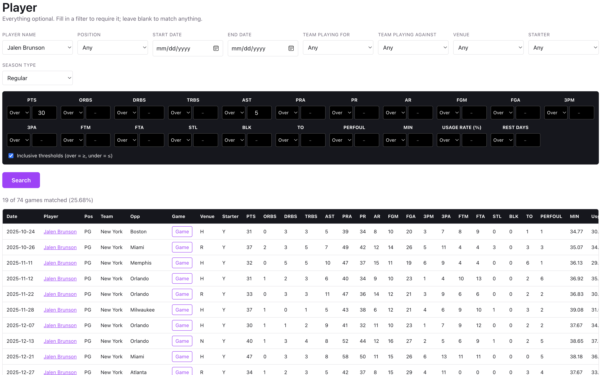
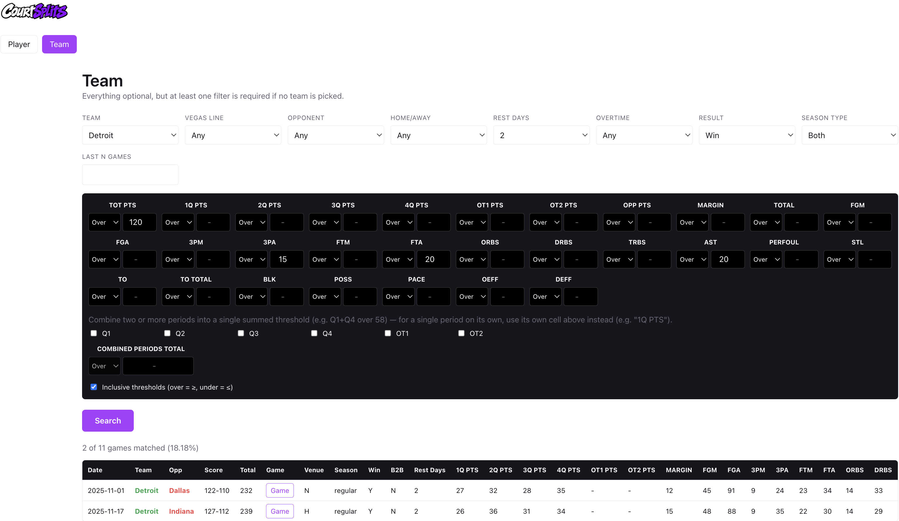

# CourtSplits
CourtSplits is an NBA statistical trend analysis web app that searches by player or team, applies filters and stat thresholds, and reports how often those thresholds have actually hit across the season, backed by full box scores and real historical betting lines for every game. Built as an analytics tool, not a bet tracker.

## Demo
 

## Features
-Search by player or by team, with configurable filters: opponent, home/away, position, date range, rest days, back-to-back, season type, etc 
-Numeric threshold conditions(over, under, equals) on any stat, with a global inclusive/strict toggle 
-Historical occurrence rate results: hit count, percentage, and full sample size, always paginated 
-Per-game drill-down with a full box score for both teams, every player, and DNPs with real reasons 
-Real historical odds data per game: spread, total, moneyline, and half-time lines, with the winning side highlighted 
-Live current-season data that updates without a redeploy, blended transparently with frozen historical seasons 
-Anonymous, privacy-preserving usage analytics, with no accounts and no raw IPs stored 
-A layered player-position system reconciling multiple real-world data sources into consistent PG/SG/SF/PF/C labels

## Technologies
-Backend: Python 3.13, FastAPI, pandas, Pydantic 
-Storage: Parquet (pyarrow) for frozen historical seasons, PostgreSQL (psycopg) for the live season and analytics 
-Frontend: TypeScript, React 19, Vite 
-Testing: pytest (backend), Playwright (frontend verification)

## Project Structure
-`engine/`: the core stats engine, with `query.py` for player and team query logic, `data.py` for cached data loading, `game_detail.py` for single-game box scores, `live_db.py` for Postgres live-season reads, and `analytics.py` for anonymous usage logging. Pure functions with no web-framework dependency, fully unit tested 
-`api/`: the FastAPI layer, `main.py` for routes and `schemas.py` for request and response validation 
-`scripts/`: the data pipeline, including `preprocess.py` (raw Excel to Parquet), `ingest_live_data.py` (loads a live-season workbook into Postgres), and `fetch_from_drive.py` (pulls the daily workbook from Google Drive) 
-`data/`: raw source workbooks in `raw/` and the processed Parquet files the app actually serves in `processed/` 
-`db/`: hand-written Postgres schema in `schema.sql`, no ORM or migration framework 
-`frontend/`: the React and Vite app, with `src/components/` holding the search screens, results tables, and game detail modal 
-`tests/`: the pytest suite

## Build and Run
### Requirements
-Python 3.13 
-Node.js, for the frontend 
-PostgreSQL, optional: only needed for live-season data and usage analytics, everything else falls back to the committed historical Parquet data without it

## Backend
`.venv/bin/uvicorn api.main:app --app-dir . --port 8000 --reload` 
Serves the API at `http://127.0.0.1:8000`, with interactive Swagger docs at `/docs`.

## Frontend
`cd frontend` 
`npm install` 
`npm run dev` 
Serves the app at `http://localhost:5173`, reading `VITE_API_BASE_URL` from `frontend/.env`.

## Running Tests
`.venv/bin/python3 -m pytest tests/ -q` 
A handful of live-data tests are skipped unless `TEST_DATABASE_URL` points at a real local Postgres instance.

## How It Works
The project splits cleanly into a data pipeline, a query engine, and two thin presentation layers on top.

Raw historical data arrives as static Excel workbooks from BigDataBall, a paid provider rather than a live API. `scripts/preprocess.py` cleans and reshapes those sheets into a handful of Parquet files, computing derived columns like margin, combined totals, and rest-day buckets along the way. Those Parquet files are loaded once per process via `functools.lru_cache`, so historical seasons, which are finished and never change, are effectively free to query after the first hit.

The current, in-progress season works differently. A Postgres database holds rows that get refreshed daily, and `engine/data.py` merges those live rows on top of the historical Parquet data, deduped by game ID with live wins on conflict, behind a short TTL cache instead of an `lru_cache`, since that data is genuinely mutable. Every layer above that merge, including the query engine, the API, and the frontend, stays unaware that two different storage backends are involved.

On top of that sits `engine/query.py`: pure functions that take a DataFrame and a bag of filter parameters and return a plain dict, with no HTTP, no database, and no side effects. That design is what makes the whole engine straightforward to unit test. FastAPI (`api/main.py`) is a thin routing and validation layer over those functions, and the React frontend consumes the resulting JSON with no router library at all, since view switching is just local `useState` in `App.tsx`.

## What I Learned
-Designing around Postgres possibly not being configured at all: the live-season feature and the analytics logging both had to behave exactly like the old Parquet-only app when `DATABASE_URL` is unset, and swallow any connection failure rather than letting a logging error turn a successful request into a 500 
-Running two caching strategies side by side: `lru_cache` for frozen historical seasons that never change, and a small hand-rolled TTL cache for the live season that refreshes daily, plus getting dtype handling right so a Postgres row and a Parquet row could be concatenated without pandas silently upcasting a column 
-Anonymizing usage data without accounts: hashing each visitor's IP with a private, server-side salt instead of storing raw IPs, since IPv4 space is small enough to brute-force a lookup table against an unsalted hash 
-Treating "the raw data says X" as a hypothesis rather than a fact: a schedule-context tag from the data provider looked like a rest-day count but was not, and the mismatch was only caught by spot-checking real games against an independent source

## Future Improvements
-Automatically disable or remove filter options that become redundant or impossible once another filter is already selected, instead of letting a search submit a combination that can never match anything 
-Source additional historical betting line data, such as player prop lines, beyond the current spread, total, and moneyline 
-Move live-season ingestion from a full truncate-and-reload to an incremental upsert 
-Add an in-app help page for a couple of known UX rough edges, such as how period-based team filters interact with the full-game total field
